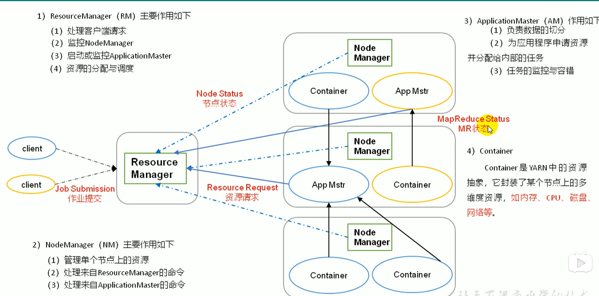

## 启动客户端
    spark-shell --master spark://master:7077
## 运行示例计算π值
    spark-submit --master spark://master:7077  --class org.apache.spark.examples.SparkPi ./spark/examples/jars/spark-examples_2.11-2.4.4.jar 10000
## yarn模式图解
   
